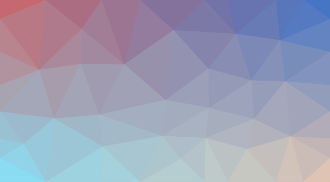
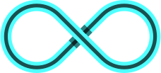
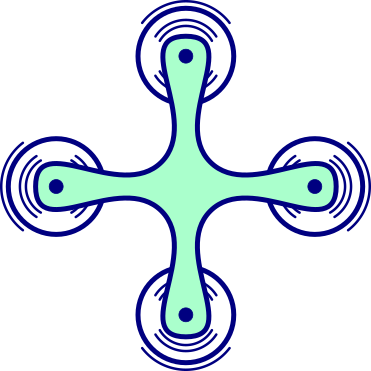
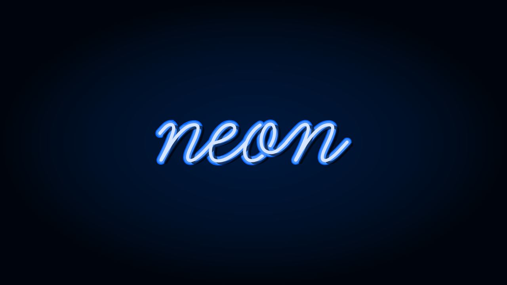
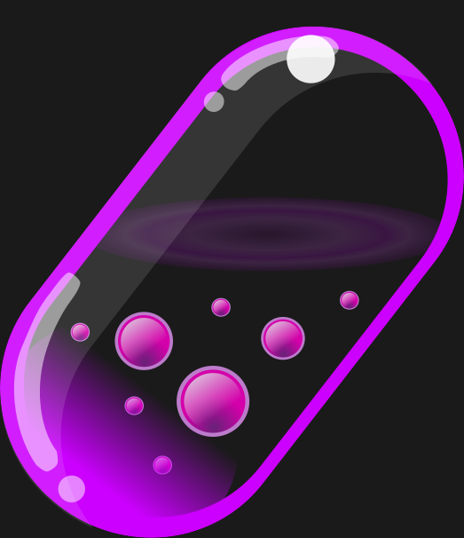

# Projects created with Inkscape
This is me dabbling in 2D graphic design. I decided to use Inkscape because it's free, open-source, and is specifically geared for SVG (scalable vector graphics) files. I think SVG files are more versatile and better suited to my needs as someone who has to create screen-responsive web pages. I also think this skill will be useful for creating custom textures for 3D objects (I really like Virtual Reality for the web).

## 1 - Gradient Letter Logo

## 2 - Low Poly Background

## 3 - Infinity Logo

## 4 - Drone Icon

## 5 - Neon Text

## 6 - Transparent Capsule
